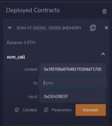
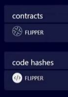

# How to Deploy Solidity

To deploy the Solidity contract on the Golden Gate network, you can follow the video tutorial [https://youtu.be/RA6M2KNMINM](https://youtu.be/RA6M2KNMINM). You can use Remix IDE to deploy Solidity contracts on the Golden Gate network. Remix IDE is an integrated development environment (IDE) specifically designed for developing and testing smart contracts on the EVM blockchain. It provides a browser-based interface that allows developers to write, compile, deploy, and debug smart contracts written in Solidity, the programming language for EVM.

Key features of Remix IDE include:

**Solidity Editor**: Remix IDE provides a code editor with syntax highlighting and autocompletion for writing Solidity smart contracts. It offers a user-friendly interface for editing code and supports multiple files and folders within a project.

**Compiler and Debugger**: Remix IDE includes a Solidity compiler that can compile smart contracts into bytecode. It also offers a built-in debugger, allowing developers to step through their contract code, inspect variables, and execute function calls to test contract behavior.

**Contract Deployment and Interaction**: With Remix IDE, developers can deploy their smart contracts to local or remote EVM networks. It provides an interface to interact with deployed contracts, allowing users to call contract functions and view contract states.

**Testing Framework Integration**: Remix IDE supports integration with popular EVM testing frameworks like Truffle and JavaScript testing frameworks like Mocha and Chai. This enables developers to write and run unit tests for their smart contracts directly within the IDE.

**Plugin System**: Remix IDE has a flexible plugin system that allows developers to extend its functionality. Developers can create custom plugins to add new features or integrate with external tools and services.

**EVM Network Integration**: Remix IDE supports connection to various EVM networks, including local test networks like Ganache and public networks like Ethereum Mainnet and Ropsten. It provides a convenient way to switch between different networks for development and testing purposes.

You can deploy the Solidity contract via Remix IDE through the following steps:

1. Go to Remix IDE - [https://remix.ethereum.org](https://remix.ethereum.org)
2. Add Golden Gate Network to your wallet and choose the corresponding injected provider. Please see Metamask for an instruction on how to do it using metamask
3. Create your .sol contract in the file explorer
4.  Go to Deploy & run transactions&#x20;

    <figure><figcaption></figcaption></figure>
5.  Press _deploy_ - authorization pop-up from a wallet should appear&#x20;

    <figure><figcaption></figcaption></figure>
6. Authorize the transaction. In case you have a sufficient amount of tokens to pay, the gas fee deployed contract will appear below.

Golden Gate supports calls to WASM from the EVM environment. To do a WASM call, you need to populate additional data:&#x20;

* _Context_ is the address of our WASM VM. For the Golden Gate testnet context is `0x1f0700e87648170284d71700`
* _Input_ is the command you are sending. It is hardcoded - `0xDEADBEEF`
* _To_ is the address of the WASM contract you want to call. You can check it in the Golden Gate block explorer. Left-click on the contract icon to copy ss58 address of the required contract \
  You need to convert the ss58 address into EVM address for EVm to understand it. For conversion, you can use [https://docs.substrate.io/reference/command-line-tools/subkey/](https://docs.substrate.io/reference/command-line-tools/subkey/)
